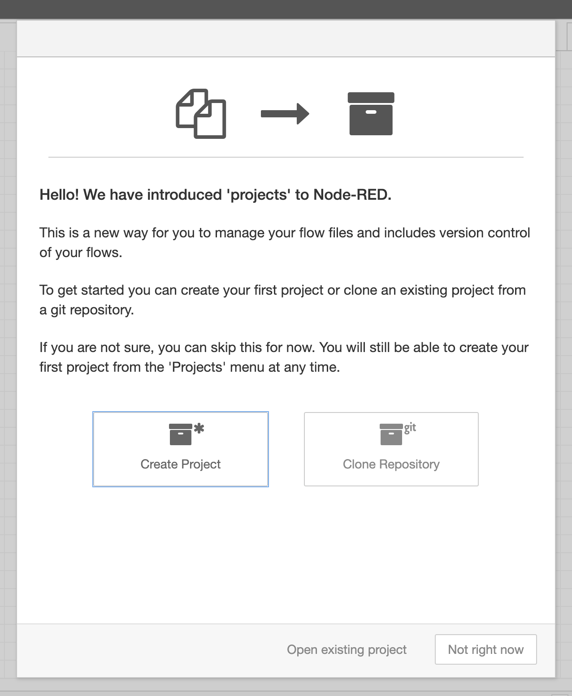

# Enabling the Projects feature

Node-RED comes with the Projects feature that allows you to version control your
flows by creating a git repository around them. You can then commit changes
from directly within the editor. You can also connect to a remote repository and
push or pull changes to that remote.

This feature needs to be enabled before it can be used.

1. Stop Node-RED by pressing `Ctrl-C` in the terminal window its running in.

2. Find your Node-RED `settings.js` file in your User directory. By default this will be `~/.node-red/settings.js`. Open it in a text editor.

3. Find the `editorTheme` section at the bottom of the file. Set the `enabled`
   property to `true`:

        editorTheme: {
            projects: {
                // To enable the Projects feature, set this value to true
                enabled: true
            }
        }

4. Save the file and restart Node-RED

The log output should now include the line:

```
23 Oct 10:49:09 - [warn] No active project : using default flows file
```

!!! attention "Troubleshooting"
    If you see a line saying `[warn] Projects disabled` then you are missing
    a prerequisite. The line should tell you what is missing. For example, if it says `git command not found` then you need to install the `git` command-line
    tool and ensure its on your path before running Node-RED.


## Creating a Node-RED Project

Once you have enabled the Projects feature, the next time you load the editor
in your browser, you will be greeted with a dialog inviting you to create your
first project.

{: style="width:350px"}


Click the `Create Project` button and follow the steps it takes you through:

    - Setup your username/email used to create commits
    - Give your project a name and an optional description
    - Set the flow file name to `flows.json`
    - Configure the encryption of your credentials file.


The project will then be created under `~/.node-red/projects/<name-of-project>`.

## Next Steps

The next task is to [install some extra nodes into the palette](installing-nodes.md).

