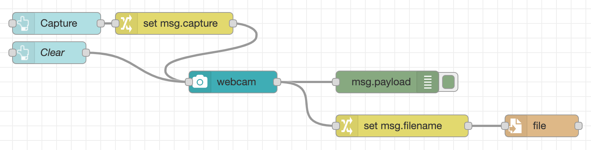

# Adding controls

## Adding a capture button

The `ui_webcam` node is fairly self-contained - providing both the live view
of the camera as well as the button to trigger taking a photo.

The node also supports being triggered by passing it a message with the `msg.capture`
property set - something we'll make use of next.

1. Add a `ui_button` node. Configure it as follows:
     - Set its group to the existing `WebCam` group.
     - Set its size to `9x1`
     - Set the icon to `fa-camera fa-2x`
     - Set the name to `Capture`
2. Wire its output to a new Change node, configured to set `msg.capture` to
   the `boolean` value `true`.
3. Wire the output of the Change node to the input of the WebCam node.
4. Edit the WebCam node and select the 'Hide capture button' option.

      {: style="width: 500px"}

5. In the Dashboard sidebar, the `Capture` node should appear *below* the `WebCam`
   node. If it doesn't, you can drag the `Capture` node down into the right order.

      {: style="width:150px"}

6. Deploy the changes.

The Dashboard will now show the new button beneath the webcam widget - clicking
it will trigger a photo to be taken.

## Adding a Clear button

By default, the webcam node shows the captured image for two seconds before
returning to the live feed.

We're going to change that so it displays the captured image until the user
either takes another photo or clicks another button to clear it.

1. Edit the WebCam node and untick the 'Clear image after...' option.
2. Add a new `ui_button` node.
     - Set its group to the existing `WebCam` group.
     - Set its size to `1x1`
     - Set the icon to `fa-trash fa-2x`
     - Clear the label field.
     - Set the Payload option to the `JSON` type and a value of `""`.

         {:style="width: 300px"}

3. Wire its output to the input of the WebCam node.
4. As before, check the new node appears below the `WebCam` and `Capture` nodes
   in the Dashboard sidebar.
5. Deploy the changes.

Now when you click the camera button the captured image will be shown. Clicking
the new button will clear the image and return to the live feed.

## Next Steps

With the initial dashboard created, its now time to [add some TensorFlow infused AI](../part3/).
