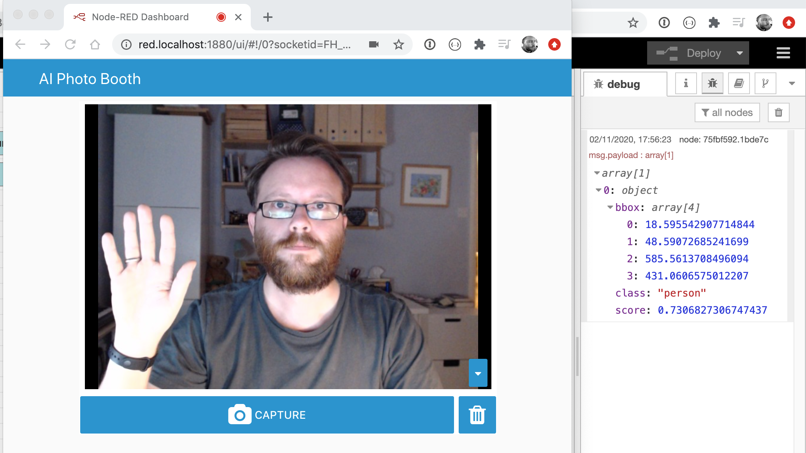

# TensorFlow in Node-RED


## Installing TensorFlow nodes

For this workshop, we're going to use the `node-red-contrib-tfjs-coco-ssd`
module that provides the `tf coco ssd` node.

This module can be installed from the Manage Palette option in the editor, or by
running the following command in `~/.node-red`:

```
npm install node-red-contrib-tfjs-coco-ssd
```

This will install the module and the TensorFlow library it depends on.


## Connecting TensorFlow to the WebCam

In this part, we'll setup the TensorFlow node to receive images from the WebCam.

1. Add an instance of the `tf coco ssd` node from the "analysis" category of the
   palette into your workspace.
2. Wire the output of WebCam node to the input of the tf node.
3. Make sure the WebCam node is configured to capture `jpeg` images - we said we'd
   remind you about this.
3. Add a Debug node and connect it to the output of the tf node.
4. Click the Deploy button to save your changes.

!!! note "Muting Debug nodes"
    In this screenshot you can see I have muted the Debug node attached to the
    webcam node by clicking its button in the workspace. This can be useful
    to turn off different bits of Debug without unwiring or removing the nodes
    entirely.


On the dashboard, make sure your webcam can see you and click the capture button.
Switch back to the Node-RED editor and open the Debug sidebar panel. You should see
the message sent by the tf node. Its payload consists of a list of the objects
it has detected.

Each entry in the list has:

 - `class` - the type of object
 - `score` - the confidence level of the detection, from `0` to `1`.
 - `bbox` - an array giving the corners of the bounding box surrounding the detected object




!!! note "`msg.payload` format"
    Each of the TensorFlow nodes uses a slightly different object format. For
    example, the `node-red-contrib-tf-*` nodes set the `className` property
    rather than `class` as we have here. If you experiement with the other nodes
    make sure you read their documentation and use the Debug node to understand
    their message format.


## Next Steps

With TensorFlow integrated into the dashboard, the next task is to
[display the detected objects on the dashboard](display-objects.md).
