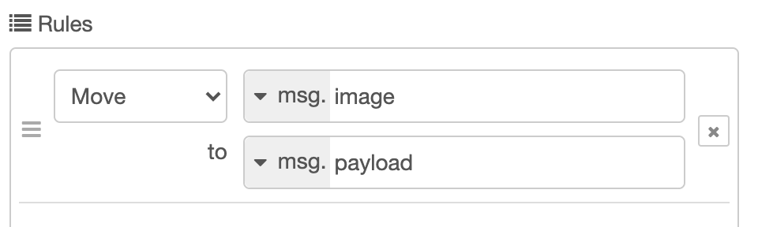
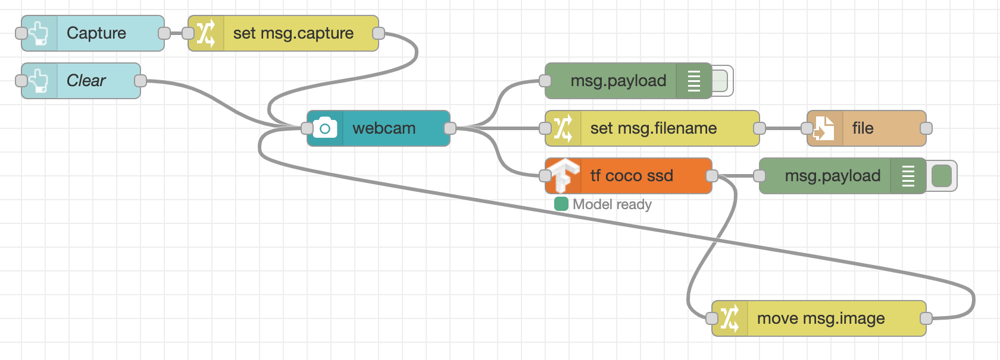
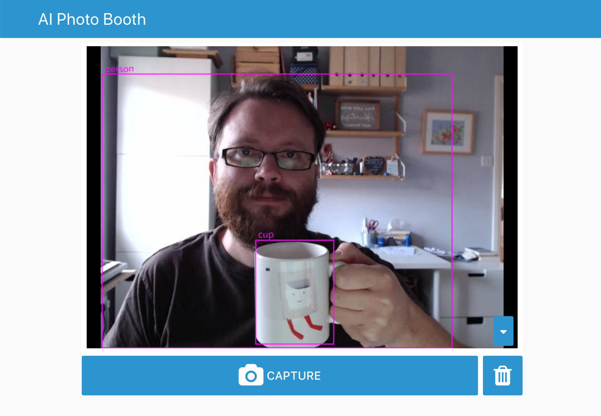
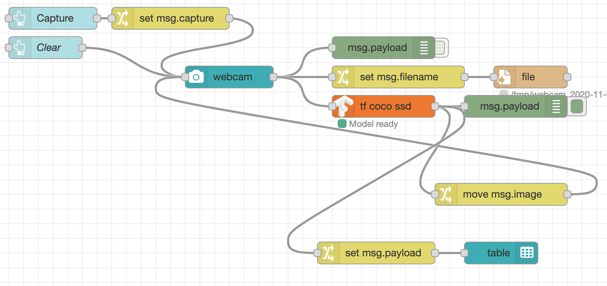

# Displaying the detected objects

In this part we're going to display the detected objects on the dashboard in two
different ways.

First we will display an annotated version of the captured image with all of the
objects highlighted. We will then add a table to the dashboard that lists them out.

## Displaying an annotated image

The `tf coco ssd` node has an option to output an annotated version of the image
with all of the detected objects highlighted. The image is set on the `msg.image`
message property.

1. Edit the `tf` node and configure the "Passthru" field to `Annotated Image`

    {: style="width:400px;"}

2. Add a Change node, wired to the output of the `tf` node and configure it to move
   `msg.image` to `msg.payload`.

    {:style="width:400px"}

3. Wire the Change node to the input of the WebCam node.
4. Click the Deploy button to save your changes.



!!! note "Laying out flows"
    With this latest addition, you can see we now have wires crossing each other
    and looping back on themselves. As flows evolve, their wiring can become
    quite complex. It is always worth spending some time trying to find a layout
    that remains 'readable'.

    There is a [Flow Developer guide](https://nodered.org/docs/developing-flows/)
    in the Node-RED documenation that provides a number of tips on how to layout flows.

Now when you take an image on the dashboard, you should see the annotated version
of the image.




## Adding a table of objects

Install the module `node-red-node-ui-table` using the Manage Palette option in the
editor, or be running the following command in `~/.node-red`:

```
npm install node-red-node-ui-table
```

This adds the `ui_table` node to the palette which can be used to display tabular
data.

1. In the Dashboard sidebar of the Node-RED editor, hover over the `AI Photo Booth`
   tab and click the `+ group` button.
2. Edit the new group and set its properties:
    - Set the name to 'Objects'
    - Set the width to `6` by clicking the button and dragging the box out to 6
      units wide.
    - Untick the 'Display group name' option
3. Add a new `ui_table` node from the "dashboard" section of the palette into your
   workspace. Edit its properties as follows:
    - Add it to the 'Objects' group
    - Set its size to `6x8`
    - Add two columns by clicking the `+ add` button at the bottom. Configure them as:
        - Property: `class`, Title: `Object Type`
        - Property: `score`, Title: `Score`, Format: `Progress (0-100)`

      {:style="width:400px"}


4. Add a Change node to the workspace. Configure it to set `msg.payload` to the
   expression `$append([],payload.{"class":class,"score":score*100,"bbox":bbox})`

    !!! note
        Make sure you select the `expression` type for the `to` field of the Change node.
        This uses the [JSONata](https://jsonata.org){:target="blank"} expression language.

5. Create the following wires between nodes:
    - wire the output of the `tf` node to the Change node.
    - wire the output of the Change node to the Table node
6. Click the Deploy button to save your changes.

Now when you capture an image on the dashboard, the table should list the detected
objects.




!!! idea "Side Quest - Star Ratings"
    The JSONata expression used in the Change node mapped the `score` property
    of each detected object from its original `0-1` range to the `0-100` range
    expected by the `ui_table` node's "Progress" column type.

    The table supports a number of other formats of displaying numeric values.
    For example, it can map a number in the 0-100 range to a traffic light colour.
    It can also display a value in the range 0-5 as a number of stars.

    Edit the table node to display the score using the star format. See if you can
    modify the expression in the Change node to map the original score to the required
    `0-5` range.


!!! idea "Side Quest - Clear the table"
    With the current dashboard, when an image is captured it gets displayed in
    place of the live web cam view until the clear button is clicked.

    However clicking the button does not clear the table we've just added.

    Using what you've learnt so far, build a flow between the Clear button and
    the table node that will clear the table when the button is clicked.

    *Hint:* think about what payload must be passed to the table in order to clear it.


## Next Steps

With the list of detected objects on the dashboard, the next task is to let the
user [select which object to display](select-objects.md).

