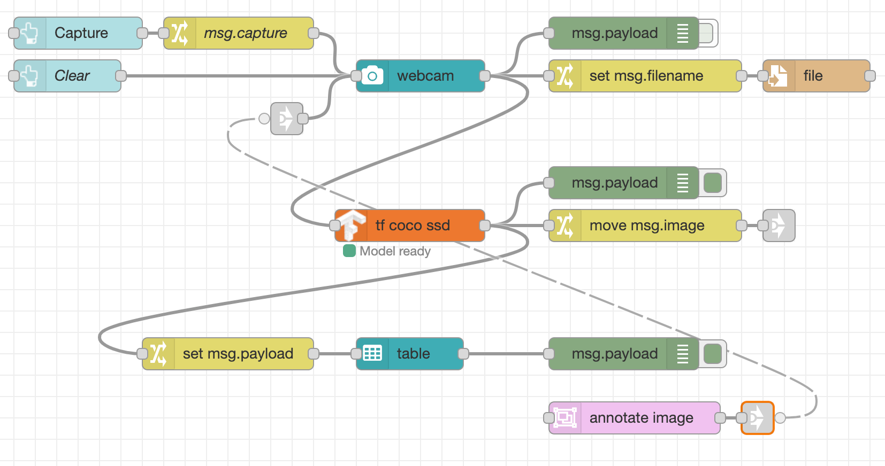
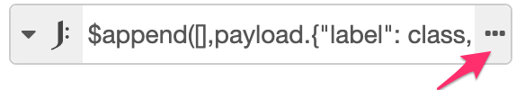
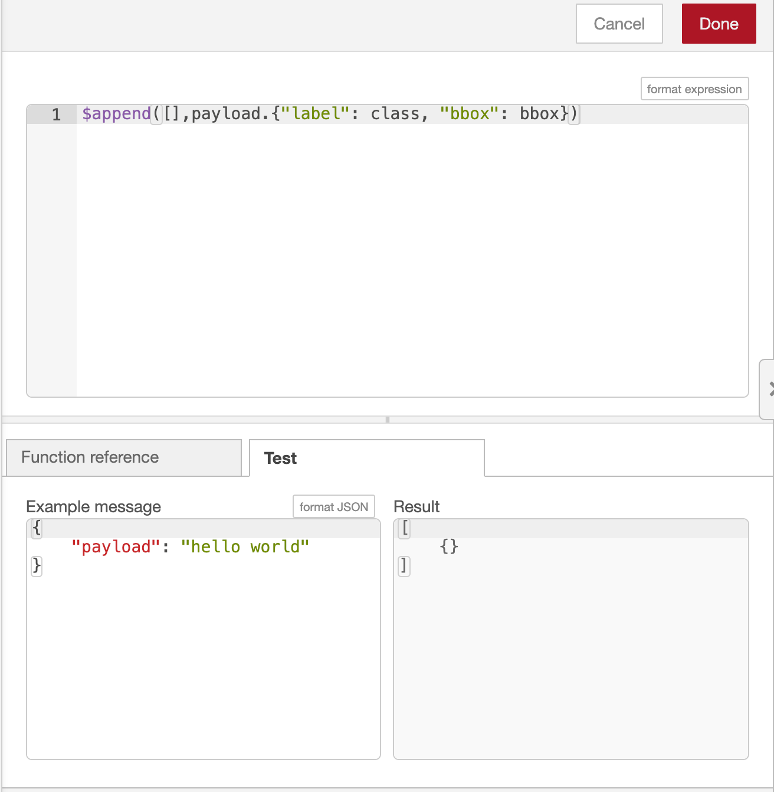
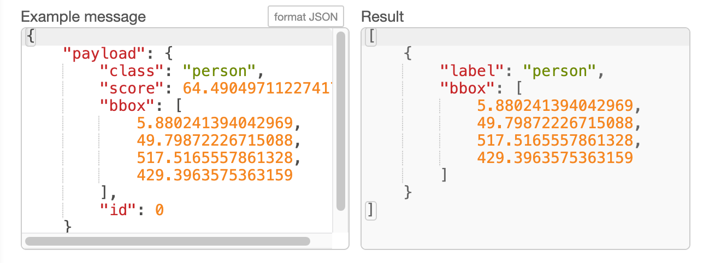
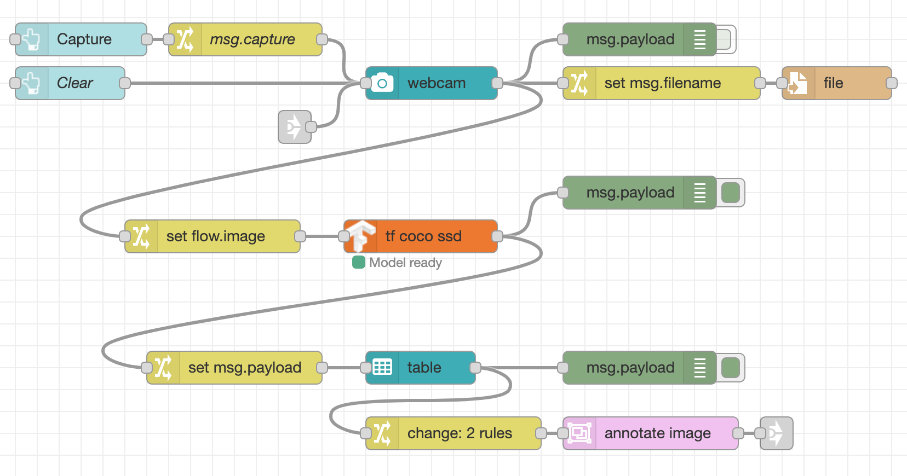

# Selecting objects to display

So far we have a flow that lets you take photo and then display all of the detected
objects in it.

In this part of the workshop we're going to change the flow to let the user select
which object to highlight in the displayed image.

Before we do that, we need to rearrange the nodes to make some space for what
we'll be adding in this section.

Here is what we have so far:


With a bit of moving around we can get to the following:


The main addition is the pair of Link nodes - a Link In node wired to the input of
the webcam node, and a Link Out node wired to the output of the `move msg.image`
Change node. Link nodes allow you to create virtual wires that only get shown
when you select a link node at either end. This can help reduce some of the
visual complexity of a flow.

!!! note "Wiring Link nodes"
    You can wire Link nodes together in two ways. One way is to double click on
    a Link node to open its edit dialog. Then select which nodes it should be
    connected to from the list shown. The nodes are listed by their name or id.
    It is always worth naming your link nodes to help you identify them in the list.
    This method can be used to join link nodes that are on different tabs in the editor.

    The other way of connecting a pair of link nodes is to first select a node
    to reveal its 'virual port' and then drag a wire from that port to
    another link node just as you would wire regular nodes.


## Making the table selectable

We need a way for the user to select the object to display and then
regenerate the annotated image with just the selected object.

The `ui_table` we added in the last step can be used to select the object.

1. Edit the table node and enable the 'Send data on click' option.

     The table node should now have an output port.

2. Add a Debug node and wire it to the table node output.


Now when you select an object in the dashboard table you will see a message
arrive in the Debug sidebar with the object's information. It will look something like:
```
{
    "class": "person",
    "score": 64.49049711227417,
    "bbox": [
        5.880241394042969,
        49.79872226715088,
        517.5165557861328,
        429.3963575363159
    ],
    "id": 0
}
```

## Annotating the image

The TensorFlow node we are using generates the image with all detected objects
annotated. It doesn't provide a way to retrospectively generate the image
with only a particular object highlighted.

To do that we can use another module: [node-red-node-annotate-image](https://flows.nodered.org/node/node-red-node-annotate-image).

This module can be installed from the Manage Palette option in the editor, or by
running the following command in `~/.node-red`:

```
npm install node-red-node-annotate-image
```

Once installed, you will find a node called `annotate-image` in the Utility category
of the palette.

1. Add a new `annotate-image` node into your workspace.
2. If you've added the Link nodes like we did at the start of this section:
    1. Wire the output of the `annotate-image` node to the add a new Link Out node
    2. Link the new Link Out node to the Link In node connected to the webcam node.
3. If you haven't added the Link nodes, wire the output of the `annotate-image` node
   directly to the input of the `ui_webcam` node.



!!! note
    In this screenshot, the virtual wire is show because the Link Out node is
    selected.

The next task is to take the output of the `ui_table` node when an object is clicked
and get it into the right format required by the `annotate-image` node.

The annotate node expects two properties to be set on the message it is give:
 - `msg.payload` should be a Buffer containing the image in JPEG format
 - `msg.annotations` should be an array of the annotations it should apply to the image.

### Storing the image

In order to annotate the image, we need a copy of the image to work on. The flow
we're working on is triggered when the user clicks on a row in the `ui_table`. This
happens as a new event - it isn't tied to original event that captured the image.

This means we need some way to get ahold of the original image in this new flow. We
can use Context to do that.

!!! information "Introducing "Context""
    "Context" is a way to store information in Node-RED that is not tied to individual
    messages passing through the flow. For example, it can be used to store global state
    that needs to be shared amongst flows.

    For more information about context, read the [documentation](https://nodered.org/docs/user-guide/context){:target="blank"}.

The first task is to store the image in context whenever a photo is taken.

1. Add a Change node in between the `ui_webcam` and `tf coco ssd` nodes.
2. Configure the node to set `flow.image` to the value of `msg.payload`.

{:style="width: 300px"}


The next task is to retrieve that image and add it to the messages coming from
the `ui_table` node.

1. Add a Change node and wire in between the output of the `ui_table` node and the `annotate-image` node.
2. Configure the node to set `msg.payload` to the value of `flow.image` - this is essentially
   the reverse of the operation done in the previous task.

{:style="width: 400px"}


### Creating the annotations

As shown earlier, the payload coming from the `ui_table` node looks like this:

```
{
    "class": "person",
    "score": 64.49049711227417,
    "bbox": [
        5.880241394042969,
        49.79872226715088,
        517.5165557861328,
        429.3963575363159
    ],
    "id": 0
}
```

In order draw that as an annotation on the image, the annotation node expects
`msg.annotations` to be a array containing an object like this:
```
[
    {
        "label": "person",
        "bbox": [
            5.880241394042969,
            49.79872226715088,
            517.5165557861328,
            429.3963575363159
        ]
    }
]
```

You can see they are very similar, but some work is needed to map between them.

1. Edit the Change node added in the previous step (between the `ui_table` and `annotate-image` nodes)
2. Add a new rule, and then **drag it to the top of the list of rules**. This is
   important because the new rule will use the information in `msg.payload`
   so needs to be applied *before* the rule that overwrites `msg.payload` with the image data.
3. Configure the new rule to set `msg.annotations` to the *expression* type and set
   the expression to:

        $append([],payload.{"label": class, "bbox": bbox})
   This will create an array of annotations with just the `label` and `bbox` properties
   set from the original object.

!!! note "Testing JSONata Expressions"
    Node-RED provides an editor for JSONata expressions with the ability to
    test the expression whilst working on it.

       1. Click on the expand button next to the Expression:

          {:style="width: 250px"}

       2. This opens the JSONata editor. You can edit the expression in the top
          pane. In the lower pane is a Function Reference and a Test tab. Click
          on the Test tab. This shows a example message on the left and the result
          of the expression on the right.

          {:style="width: 400px"}

       3. Copy the example output of the annotate node from above and replace
          the `"hello world"` example payload. You should see the result update
          with shown here.

          {:style="width: 400px"}


You should now have a flow that starts with the `ui_table` node, passes through
a `Change` node to format the message, then to an `annotate image` node and finally
to the `ui_webcam` node, possibly via a Link node.

Before deploying these changes there are couple more changes to the flow needed.
We aren't going to use the image produced by the `tf coco ssd` node anymore.

1. Delete the `move msg.image` Change node that is connected to the output of
   the `tf coco ssd` node. If you added the Link Out node, delete that as well.
2. Edit the `tf coco ssd` node to set the Passthru option to `nothing`
3. Click the Deploy button to save your changes.

Now when you capture an image on the webcam, you'll see the captured image on the
dashboard without any annotations. The table below the image will list the
detected objects. Clicking on an object will update the image to highlight the
selected image.

This is what the final flow should look like:




## Next Steps

With the application complete, the next task is to [wrap it in a container](/part4/).