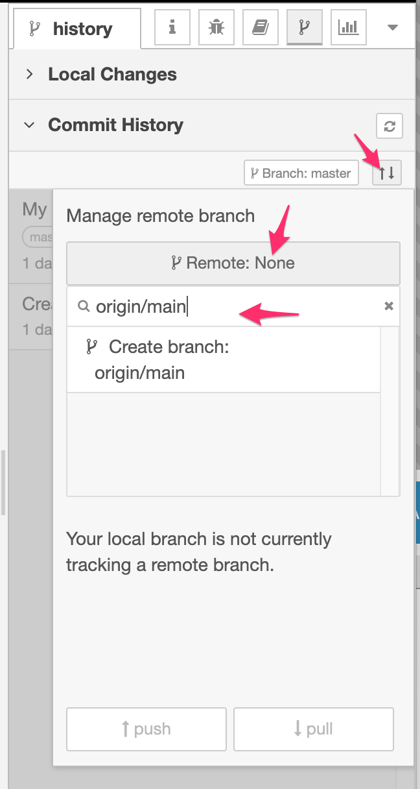
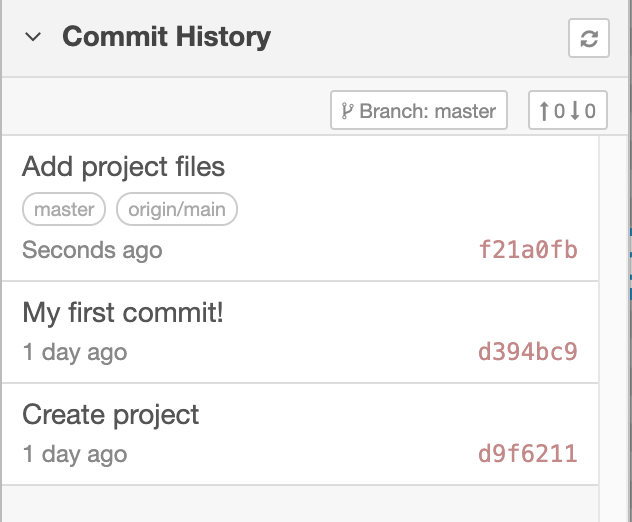

# Finishing the project

Having made these final changes to the project, restart Node-RED and open up the
editor in your browser.

In the history sidebar you will see the files you've been modifying.

{: style="width:300px"}

1. Click the `+ all` button to stage all of the files in one go.
2. Click the commit button, enter a commit message and commit the changes.

At this point, your project's git repository is completely up to date.

## Pushing changes to GitHub

The Node-RED projects feature supports adding a remote repository to push and
pull changes to.

This step is entirely optional and is provided here for your information.

!!! note "Other hosted git services exist"
    Whilst the instructions here cover GitHub, the same basic steps apply
    for the other hosted git services such as GitLab.

1. Create a new repository on GitHub. Do not initialise the repository with any
content.

     Make a note of the **`HTTPS`** url for the repository.

     {:style="width: 500px"}

2. Create a new personal access token for your GitHub account

    1. Open your GitHub Developer settings page to create a new Personal Access Token - [https://github.com/settings/tokens](https://github.com/settings/tokens){: target="blank"}
    2. Generate a new token with the `repo:public_repo` scope.
    3. Make a note of the token - you won't be able to see it again after you close that page.

    !!! note "Access Token vs SSH"
        Node-RED also supports SSH access to repositories, although it takes a few
        more steps to setup. We're going with the Personal Access Token as an easier
        approach for now.

3. Open the Project Settings dialog from the main menu in the editor (`Projects -> Project Settings`)

4. Switch to the `Settings` tab.

5. Click the `add remote` button to expand the 'Add remote' dialog. Enter the `HTTPS` url for your repository
   and click the `Add remote` button at the bottom.

    {: style="width:450px"}

6. Go to the `Commit History` section of the `History` sidebar tab.

7. Click the button with two arrows in - this opens the "Manage remote branch" dialog.

8. Click where it says "Remote: None" to expand the branch select box.

9. Type in `origin/main` into the box and then click the "Create branch" box.

    {:style="width:300px"}

    !!! note ""master" vs "main""
        GitHub recently changed the default branch to be called `main` rather than `master`.
        If you are using a different git hosting service, check what the default branch
        is called and use that here.

10. Click the `push` button to push your changes to the remote. You will be prompted
    for authentication details. Provide your GitHub username and use the Personal
    Access Token you generated as the password.

    {:style="width:450px"}

    !!! note "Storing passwords"
        Node-RED only holds your remote repository username and password in memory - it does not store
        them anywhere. That will mean you will need to provide them again the first
        time you interact with the remote repository after restarting Node-RED.

11. All being well, after a few moments the "Manage remote branch" dialog should
    close and the commit list refresh.

    You should the most recent commit is has both the `master` and `origin/main`
    labels. This shows you your local repository is level with the remote.

    The button with the arrows (that opens the Manage remote branch dialog) now
    also shows how many commits ahead or behind your local repository is compared
    to the remote.
    {:style="width:300px"}

